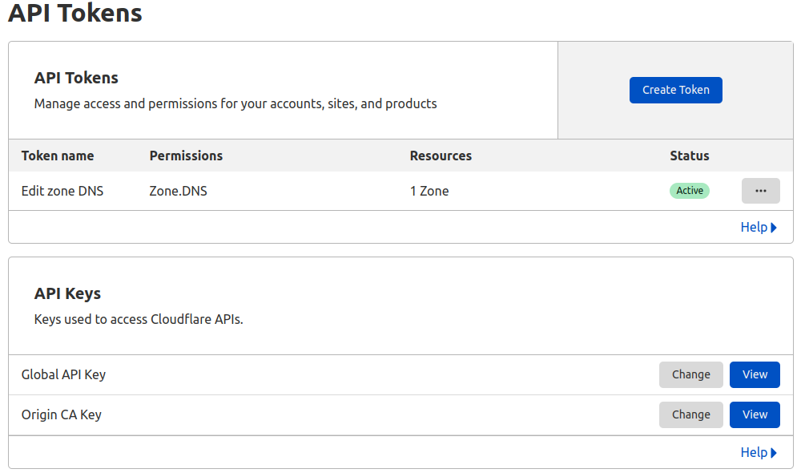

## What is this?
Yet another dynamic dns app for cloudflare.

## What you need.
A cloudflare account with an api token.

## How to use.
git clone https://github.com/MikeCase/ddns
cd ddns/
python3 -m venv ~/.config/venv/ddns
source ~/.config/venv/ddns/bin/activate
pip install -r requirements.txt

edit .env-example with your specific needs and save as .env

python ddns.py

## Running from a crontab
Witout Log

0 */6 * * * ~/.config/venv/ddns/bin/python ~/ddns/ddns.py >>/dev/null 2&>1

With Log

0 */6 * * * ~/.config/venv/ddns/bin/python ~/ddns/ddns.py >> ~/ddns/ddns.log 2&>1
